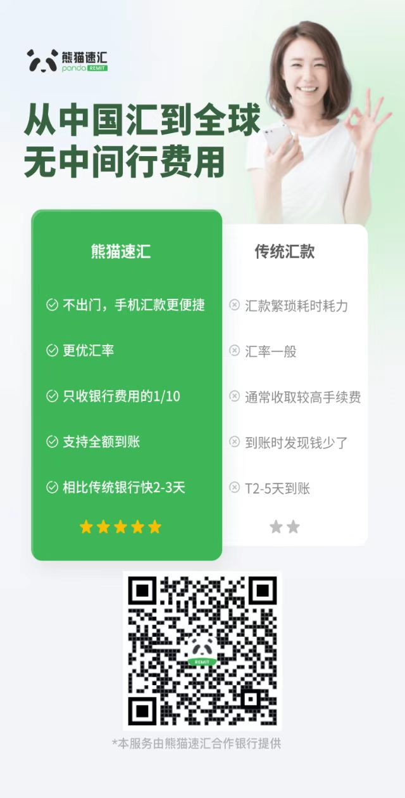
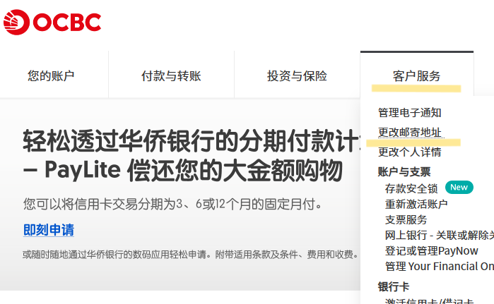
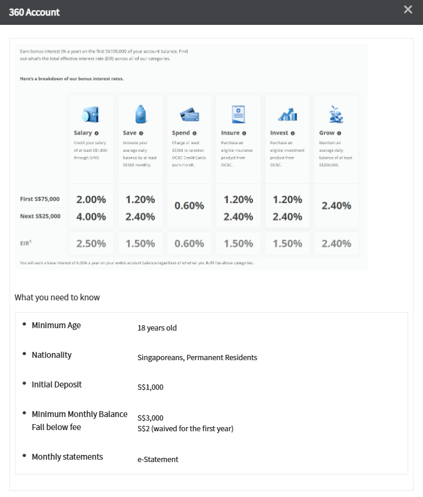
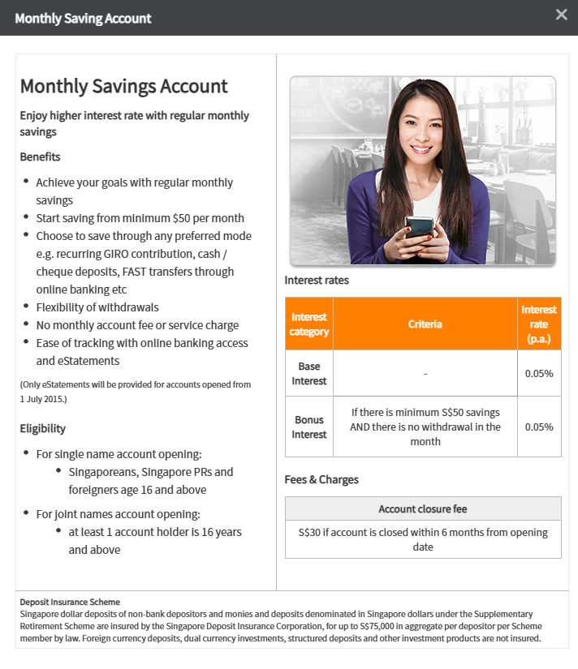

## 如何申请OCBC的实体银行卡（教程）

##### 前言
-----
 一直想申请一张海外的卡，以前得去HK申请，肉身还得去柜台面签，嫌费事。后来在得知可以申请OCBC的卡，于是就按照网上的教程自己申请了，在此要感谢这些前辈。那我为什么要自己写一篇文字来记录呢，因为这里面有一些坑需要避免。如果您需要新加坡的银行卡，可以自行全程网上申请。请注意，本文仅供参考，不承担相应风险。 
**未经本人授权，不得转载**

 欢迎大家使用我的推荐码  OCBC=**GJGQ37JB**，熊猫=**11193657** ，新人会有15新币和10元抵用券的奖励。 熊猫可以扫下图的二维码下载。
  
 
 * 经网友提醒，在申请360账户之后，如果你只想使用**虚拟卡**而不需要实体卡，那么在出现虚拟卡信息的时候需要截图保存。一旦申请了实体卡片，虚拟卡信息就看不到且**虚拟卡作废了**。（2024-3-14）
 * 有网友反映，在职业填写上如果填写了餐饮啊之类的，会出现审核不通过的情况(2024-4-9 更新) 
 * 增加了**长桥证券**的信息和说明。（2024-4-12更新）
 * 有网友反映审核被拒后，需要更换手机和手机号再次申请，审核通过的机会才高（审核是个玄学）。（2024-04-27update）

##### 目录
* 0.有什么好处
* 1.准备材料
* 2.激活账户
* 3.申请实体银行卡
* 4.出现问题怎么办
* 5.后续
* 6.美股 

#### 0.有什么好处
大概有以下几点： 

*  可以申请到2个以上的新加坡账户，用于海外理财等
*  可以跨境收付款
*  借记卡支持Apple Pay等移动支付
*  可用于海外炒股

#### 1.准备材料
* 支持NFC功能的苹果手机或安卓手机（本人是苹果，安卓未测试）
* 护照和身份证
* 大陆手机号
* 准备至少1000新元作为激活账户 
  
  
##### 1.1 下载app，名字叫“OCBC Digital”。
 在app store直接搜索即可，如图所示。
  
##### 1.2 注册
   * 安装完成后，打开app，注册成为新用户，可以填写我的邀请码**GJGQ37JB**，30天内激活账户，新人和推荐的人都会得到15新元的奖励。如果你不需要，当然可以不填。 
    
    
  * 填写手机号，国内的，+86开头。请注意，手机号最好跟你国内银行卡的柜台预留手机号一致，这到了后面转账那个环节避免麻烦。
  * 完成扫描护照和身份证。这里提醒一下，需要照片，而不是扫描件。所以，可以提前把照片拍好存在手机相册里。在扫描护照的时候，要注意一点，护照的芯片位置，手机从上到下扫描，识别到芯片的位置就停那不动，等待识别完成。
  * 人脸识别。这点跟国内大多数app一样的。
  * 填写个人信息，如工作地址、税务信息等。中国的税务识别码就是身份证号，这点注意。填写工作情况的时候，特别注意，一定要选择**非自雇**，这个原因未知，很多人因为没选这个，导致账户申请不通过。那如果你的真实情况是自雇，如个体经营者，那么你也不要选自雇，你可以给自己冠个头衔，比如总经理。
  * （2024-4-9更新）有网友反映填了餐饮企业，被银行拒了，他怀疑是这个原因，收到的提示是「经过审核不通过」，在此建议填写公司名称时尽量避免餐饮娱乐商场之类的词汇，是不是银行人员审核的时候对这些职业敏感？期待有银行业的专业人员解答。当然，也可能只是特例。 我当初填写的职业是IT Manager,单位名词也是一看就知道是软件行业的，类似xx研发中心，xx研究院，xx信息有限公司。
  
  * 要求你填写**用户名**时，自己拿个本子记录下来，这个**用户名和密码**很重要，在网页端登录的时候需要用到，网页登录界面上的**ACCESS Code和PIN**就是这个时候设置的用户名和密码。银行的网页地址是 https://internet.ocbc.com/internet-banking/Login/NormalLogin
  
  * app有**OneToken**需要在手机上激活，这个操作用于绑定手机，所以后期换手机的话，这点需要迁移到新手机，否则会很麻烦。
  * 在整个操作中，尽量避免app切换到后台被杀死重启的情况。所以前面提醒说把资料提前拍好存在相册中。

材料提交完后，官方说需要5-7个工作日，实际情况是很快。我当时周五申请，周一傍晚就通过了。这可能跟银行的人员效率有关。耐心等待就行。 

#### 2.激活账户
开户成功后，需要在30天内入金至少1000新元来激活(网上有说法需要**同名账户来激活**)。我使用的是熊猫速汇来进行转账的。当然，你也可以使用其他的方式，比如WISE，各银行app中购汇，然后转账。但是，如果你没有留学的要求，很多银行会拒绝。下面介绍一下熊猫速汇款。这里同样仅供参考，不承担相应风险。 

* 审批通过后，OCBC会有两个账户
    Statement Savings Account（SSA）
    Global Savings Account（GSA） 

* SSA是新加坡居民账户，对非居民的存款要求很高，账户余额至少2万新币才可以免收每月的管理费，所以才有后面申请360账户的动作。当然，一年内是免账户费用的。这个账户是以**001**结尾。（笔误，之前写成STS）
* GSA是美元账户，可以理解为外汇账户。这个账户是以**201**结尾。
* OCBC的硬性规定是至少需要保持一个常规账户（暂时这么称呼），所以，后期申请360账户后，把银行卡绑定到360账户，（6个月后）就可以把SSA账户注销。360账户的余额要求是3000新币，否则收2新币每个月。凭心而论，这个价格还不算贵，保卡很划算。
##### 2.1 熊猫速汇入金
* 头一次接触熊猫的时候，难辨真假，不敢从app store下载，找到了官网后，从官网的二维码过去下载的。其实这两个是同一个。这里同样推荐我的邀请**11193657**码，填写了邀请码会有10元抵用券。
   
   
* 熊猫速汇的注册和认证比较简单，注意手机号和之前ocbc注册留的手机号保持一致。
* 转账的时候，需要注意几个点，填写姓名和时候，要跟ocbc申请时填写一样，收款银行选择**OCBC Bank-华侨银行**，银行账户填写自己的SSA账号，街道和门牌号可以填写银行的，也可以填写自己的（这点似乎不重要）银行的地址是63 Chulia Street #10-00, OCBC Centre East, Singapore 049514，收入来源选择**工资**，汇款类型选择**其他私人旅行**，汇款用途选择**因私旅游**。最后进入汇款环节。
* 熊猫的汇款订单完成后，会要求你从国内的其他银行把钱先汇款到熊猫——天津金城银行，这其中的注意点是**备注**。基本上按照界面提示，复制粘贴过去就行。如果有抵用券可以使用，正常是80元手续费，抵用后就是70元。我在凌晨时段进行的操作，大概10分钟就到账了。
* 当然，熊猫挣钱除了手续费外，在汇率上也挣钱了，这是他们的模式。

#### 3.申请实体银行卡
有了OCBC的账户后，可以进一步申请实体银行卡。 

* 修改邮寄地址，这点可以在网页端修改，路径是「客户服务」-「更改邮寄地址」。注意点是在邮寄地址上一定要写上你的手机号，+86开头，至于详细的地址，由于字数限制，你填写到路名就可以，路名可以用拼音代替，比如解放北路，你就写 Jie Fang Bei RD.即可。小区名称简单的会写就写，不写也没事。至于区属，也用拼音，比如 鼓楼区就写 Gu Lou District。 有人说为什么要强调地址上写+86的手机号，不写也是能收到邮件的。实际上，邮政小哥很多人是看不懂地址，尤其是英文地址。与其把能不能收到快件寄托在邮政小哥身上，不如让他按照留的地址给你打个电话，就什么都说清了。这是我的个人观点，供参考。 
    
  
* 登录网页版时会要求填写用户名和密码，即**Access和PIN**，就是前面让大家记录下来的。
* 每次网页端登录，在手机端都会有提示，要手动点击同意。第一次会有短信验证码。
* 登录以后，可以改语言为中文
地址填写注意点如下
 
 * 保存后就可以了。这里**填写手机号在地址里**是至关重要的。
##### 3.1 申请360账户
* 可以在手机上操作，也可以在网页端操作，建议在手机上操作，原因后面说。路径都是导航栏“申请 – 账户 – 360 Account”。
* 在填写信息的时候，注意点也是**职业不要选自雇**。
* 申请完成后，可以在**安全邮箱**里面发送询问物流单号的信件，银行客服会回复的，只是速度比较慢。物流基本需要2周(10天左右)时间才会收到卡片。给出两种种询问物流编号的英文例子，省去你翻译的时间， **Hi,What is the mailing number of my bank card? thank you.** ，如果你想客气一点就这样说  **Hello,May I know my bank card mailing number,thank you.** 

#### 4.出现问题怎么办
* 我遇到的**问题1**：网页端360账户申请成功了，但是不能申请卡片，所谓的“有户无卡”的状况。经查询才知道，需要在网页端，取消关联现有的360账户，操作是 网上银行->取消360账户的关联，然后再去手机端申请，后面就好了。这可能是app的一个bug。
   
* 我遇到的**问题2**：无意中购买了一笔**单位基金**，自己当时没有注意这笔账“消失”了，后来发现账户总金额不对，才想着去查一查。最后发现这笔账的状态是“in process”，意思是这笔钱出去了，但是账户中还没有体现出来。这中间大概有一周的时间，账户最终才体现出来。如果你也有类似的情况，不用着急，自己查一查流水可以发现的。
* 怎么跟银行联系：一是给他们客服打电话，这点对大多数人可能不适合，尽管有懂中文的客服。二是通过**安全邮箱**给他们发邮件，要求是英文书写。那就自己先写中文，借助翻译软件翻译成英文。邮箱回复比较慢，但基本都会有回复的。比如前面提到的索要物流单号。
* 其他的转账之类的，这里就不谈了。 
  
  （2024-3-8）

#### 5.后续 
* OCBC还有一种账户是「Monthly Savings Account」简称MSA，**尾号001**。这类账户只需要每月保持在500新币即可免除卡费。后来我也开了这个账户，把卡片做了关联。
*  银行卡的费用，年费0，主要是海外取现金和消费，会有外币交易手续费3.25%和货币兑换费2.80%。详情见[官方说明](https://www.ocbc.com/iwov-resources/sg/ocbc/personal/pdf/help-and-support/cards/debitcard-fee-charge.pdf) 
*  GSA 账户永久免管理费：https://www.ocbc.com/personal-banking/deposits/multi-currency-global-savings-account 

MSA 管理费：https://www.ocbc.com/personal-banking/deposits/monthly-savings-account 

SSA 管理费用 https://www.ocbc.com/iwov-resources/sg/ocbc/personal/pdf/help-and-support/general/personal-banking-pricing-guide.pdf

* 360账户的开户说明     
* MSA账户的开户说明  

##### 5.1 合理保卡 
* 网页端开设 MSA账户，存入500新币不动。 
* 手机端app操作，将银行卡在绑定到MSA账户。360账户和SSA账户在6个月后，如果没有存款会自动关闭。 官方说明有写如果6个月内关闭会收30新币。（这两点待验证）
  
  至此，OCBC银行的保卡旅程完毕。 

(2024-3-11)

#### 6. 美股
原本打算把美股这个话题单开的，后来想想也没多少话要讲，就跟在这个贴子后面吧。
我使用了两款美股软件，一家新加坡的，一家是长桥证券，经过了一段时间的使用，有一点小小的心得，推荐大家使用长桥，这是结论。

* 对炒股高手而言，尤其是做长线的，无论是哪款软件都是差不多的，但是如果是做短线和超短线的，我推荐长桥证券。对比之后才会发现，软件的信息卡不卡是决定做短线的关键。我只能说长桥很流畅，新加坡那家的就有点卡，卡到影响你做决定的那种。
  
* 入金的便利性，两者一样。注册长桥的时候，可以开通新加坡账户，特别提醒**用护照**，而不是身份证去申请新加坡账户。因为ocbc也是通过护照申请的，需要两者保持一致才能开通长桥的入金方式————DDA方式。DDA入金方式需要长桥跟OCBC银行的eGIRO支付服务对接，这个类似于国内的第三方支付协议。开通了DDA入金以后，就是一秒入金了，很便捷。（2024-4-18更改）
  
* 软件的界面美观，至少我的角度，一位专业程序员的角度，长桥是符合我的眼缘的。当然，这种审美问题，各花入各眼。推荐大家试用一下。
  
* 长桥的市场人员联系谈合作推广，以下是他们的推广信息，通过链接注册的是港股账户（含美股）。我想了想，这是双赢的一件事情，长桥多了新客户而网友也可以争取奖励，可以做。新建了一个微信群，里面有长桥的客户经理。群二维码容易失效，这里就先不贴啦。可以在twitter @0EE4GA9d 加你进群。

* 经过半年的美股，有些许经验，但最近面临着利润回撤。
  
（2024-8-6更新）
