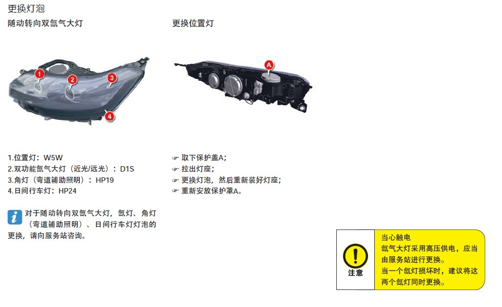

## 汽车大灯修复翻新记DIY

车子买的时间久了，大灯老化严重。  
去年年检时，就说大灯不够亮。今年吧，我看外壳发黄了，就用砂纸磨了磨，就去年检了。车灯是这个模样，我就敢去车检了。

果不其然，卡在大灯上了。  
我还叮嘱车检的人要刷油，但是那家伙没刷。说是刷了也就提高1000点，你车子才4000.必须得15000才能过车检。于是断定我的灯泡有问题。  
估计，我们都错怪灯泡了。明明是灯罩惹得祸，却让灯泡背了锅。😁😁😁  

检测站的人说你去换个灯泡就行，20块钱。我不太相信，但还是出去找了店铺问了价格。

氙气大灯的灯泡修理店要收我280一只，两只就是560。我说这也太贵了呀，而且你用的还不是原厂灯泡。对方不肯让价。就算了吧，回来从网上买。  

回来看了一下汽车保养手册，发现换大灯灯泡很容易的，于是就网上下单了原厂灯泡和大灯清洗翻新套件。
厂家的维保手册如下：
* 大灯外壳保护漆  

* 灯泡更换位置  

####  这里跟大家分享一下我查到的关于大灯翻新的知识点，主要有三种方式。
1、给大灯外壳打磨后，喷（涂）一种修复液，优点是喷起来方便，但是要烘干或自然暴晒一小时。
2、打磨后，用化学熏蒸。用甲苯熏蒸跟灯罩外壳塑料发生化学反应。
3、用10000号以上的修复液+电动抛光盘去修复，原理是物理抛光。

#### 最终，我选择了第一种「涂」的方式。原理嘛，药水主要成分是环氧树脂会有张力形成平面，拉平了毛玻璃的坑洞。
* 涂完药水后  

等药水干了以后再去年检，如果确实是灯泡的问题，就换上原厂的灯泡。
（2024-09-29）