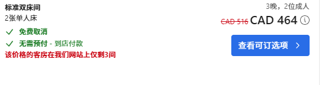
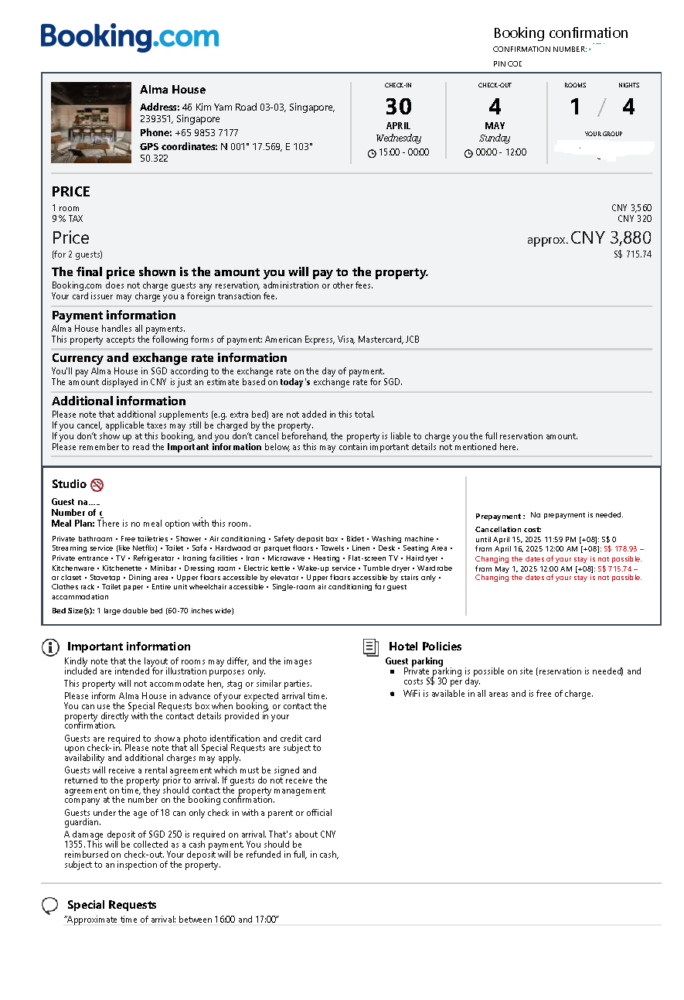

# 熊猫入金OCBC

## 前言
-----
 去年写过一篇[申请OCBC的攻略](../../2024/03/01.md)，那会儿从熊猫入金还很方便，现在多了几个注意事项，展开说一说。请注意，本文仅供参考，不承担相应风险。 

**未经本人授权，不得转载**

 欢迎大家使用我的推荐码  OCBC=**GJGQ37JB**，熊猫=**11193657** ，新人会有15新币和10元抵用券的奖励。 熊猫可以扫下图的二维码下载。
   

## 注册熊猫
* 头一次接触熊猫的时候，难辨真假，不敢从app store下载，找到了官网后，从官网的二维码过去下载的。其实这两个是同一个。这里同样推荐我的邀请**11193657**码，填写了邀请码会有10元抵用券。
  
* 熊猫速汇的注册和认证比较简单，注意手机号和之前ocbc注册留的手机号保持一致。

## 转账发起
* 转账的时候，需要注意几个点，填写姓名和时候，要跟ocbc申请时填写一样，收款银行选择**OCBC Bank-华侨银行**，银行账户填写自己的SSA账号，街道和门牌号可以填写银行的，也可以填写自己的（这点似乎不重要）银行的地址是63 Chulia Street #10-00, OCBC Centre East, Singapore 049514，收入来源选择**工资**，汇款类型选择**其他私人旅行**，汇款用途选择**因私旅游**。最后进入汇款环节。

## 准备资料
* 在2025年，熊猫增加了提交旅行材料才能审核通过的步骤，具体为护照、住宿或机票订单（我这里就以住宿订单为例）、出入境记录。 
* 护照这块需要用手机相机拍摄，so，准备好护照首页。（下次可以试试对着电脑拍）
* **住宿订单**，我是从booking上预定的。特别注意，需要选择那种可以**免费取消**的那种。我呢，就选择了目的地是新加坡。
* 预定结束后，会有预订单，下载下来，中文英文都可以。 。因为我没有打印，只能对着屏幕拍照。但是拍摄窗口大小和这个屏幕文本的方向不一致，在pdf查看器里旋转了90°才拍进去。
  
* **出入境记录查询**：这个要特别说一下，很多人不清楚去哪查询。最方便的是支付宝或微信里的小程序「移民局」，通过支付宝的实名认证功能，可以直接发送到邮箱，是一个加密的pdf文件。   当然也可以去[移民局网站](https://www.nia.gov.cn/)，找到「办事服务」->打开「移民出入境网上办事平台」，在新的页面里找到「证件信息查询」->「出入境记录查询」。这里会用到小程序的扫一扫登录和实名认证。所以，还是推荐通过移动端小程序去查询和导出。
  

## 转账
* 熊猫的汇款订单完成后，会要求你从国内的其他银行把钱先汇款到熊猫——天津金城银行，这其中的注意点是**备注**。基本上按照界面提示，复制粘贴过去就行。如果有抵用券可以使用，正常是80元手续费，抵用后就是70元。
* 当然，熊猫挣钱除了手续费外，在汇率上也挣钱了，这是他们的模式。

## 确认
* 最后去OCBC账户上确认是否已经收到汇款。
  （2025-03-15）

