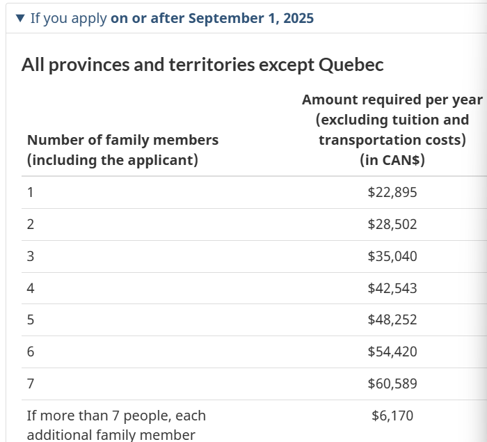

# 申请加拿大学签

## 0 准备工作
### 0.1 语言的学习 参见[语言的学习](./09.md)

### 0.2 英语证书
我大概是在10月30号申请了学校，也获得了condition offer。这个地方有个误区，我以为必须得等到拿了语言证书才能申请。实际上是不需要的。只要你的语言学习到了pathway阶段，就可以开始申请了，不管是1，2还是3阶段。
要交150加币报名费，然后是缴纳押金3500加币。
关于缴费这里是有误区。PayMyTuition是一个资金中介。你把国内的货币转账给它，它再把钱转给学校。当然这里有汇率的问题。那么，我们把钱转给它的路径就有好几个，理论上通过银行转账的方式也是可以的，而且也是安全的。但是，在直觉上感觉不放心。问了其他人，说是通过支付宝扫二维码转账给的，于是我也用支付宝转的，贵了大概100块钱的样子。

### 0.3 资金的准备
 IRCC官方有个清单，一个人是22,895，两个人是28,502.  .
 那么，根据学费要求和生活费来准备资金。比如我的第一年要求22,590加币，那我只要准备25k+30k=55k 理论上就够我和娃两个人生活了。当然，我准备了2年的费用。

### 0.4 翻译件
网上的很多说法呢，要求公证。我不太理解，也没有找到官方明确的要求原文。比如，我提供了户口本，那我同时提供户口本的翻译件，这在逻辑上是说得通的。但是，有没有说一定要你把户口本翻译了以后再去公证呢，并没有这样的说法。

## 1 实际操作
时间表如下：     
    
| 日期 | 内容 | 
| ------ | ----------- |
| 2025-10-30 | 提交了学校的申请 |
| 2025-10-31 | 要求补充语言水平文凭。我提交了在读证明，不认可，要求语言学校开个证明出来。 |
| 2025-11-5   | 提交了在读证明，收到了 condition offer |
| 2025-11-19  | 交完押金，收到了 condition offer确认单 |
| 2025-12-19  | 提交了语言文凭  |
| 2025-12-20  | 收到了	Unconditional - Confirmed |
| 2025-12-25 | 前几天预约了这天去体检，这天是圣诞节。体检内容没有什么特别的，但是收费1700大洋。身高体重，测了视力。然后抽了一管血看看有没有一些传染病。最后是查体，看你有没有特别的地方。哦，最后还搜集了新冠信息。 |
| 2025-12-27  | 修改了好多次的解释信，在其他证据合适的情况下，我提交了。|

## 2 感悟

